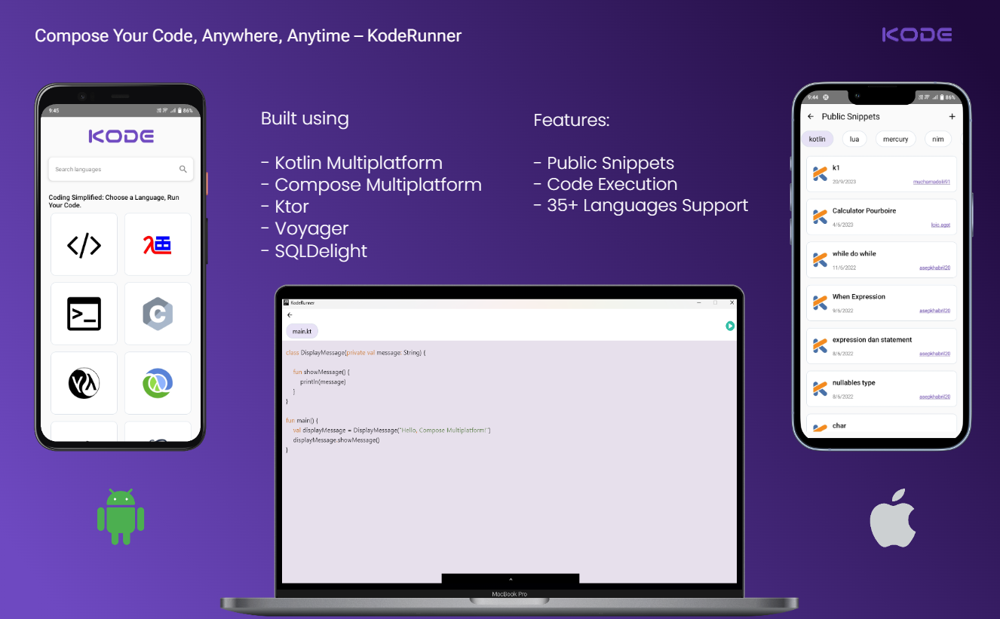
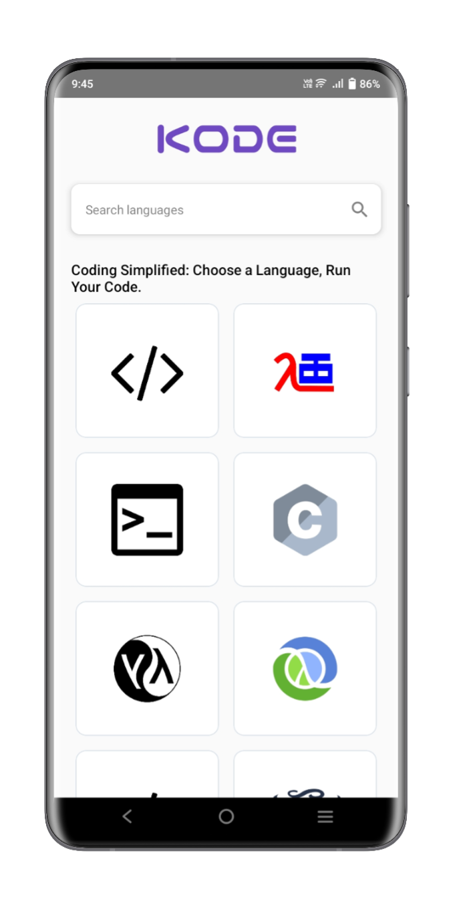
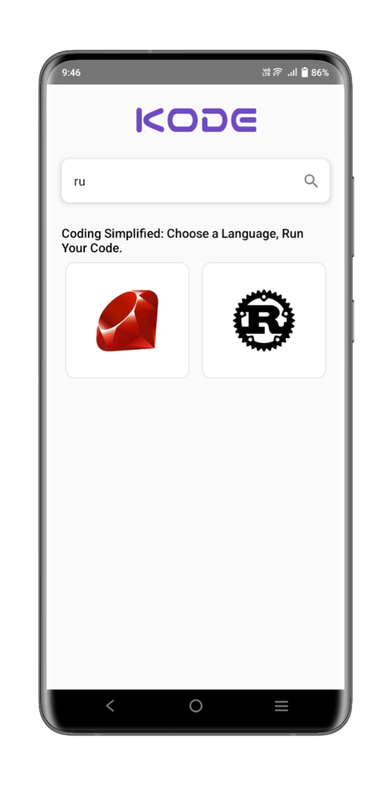
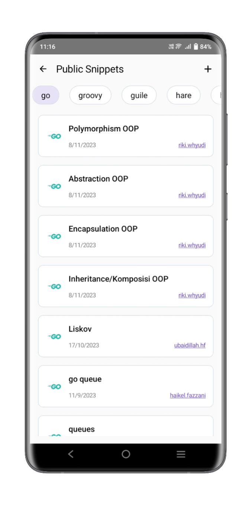
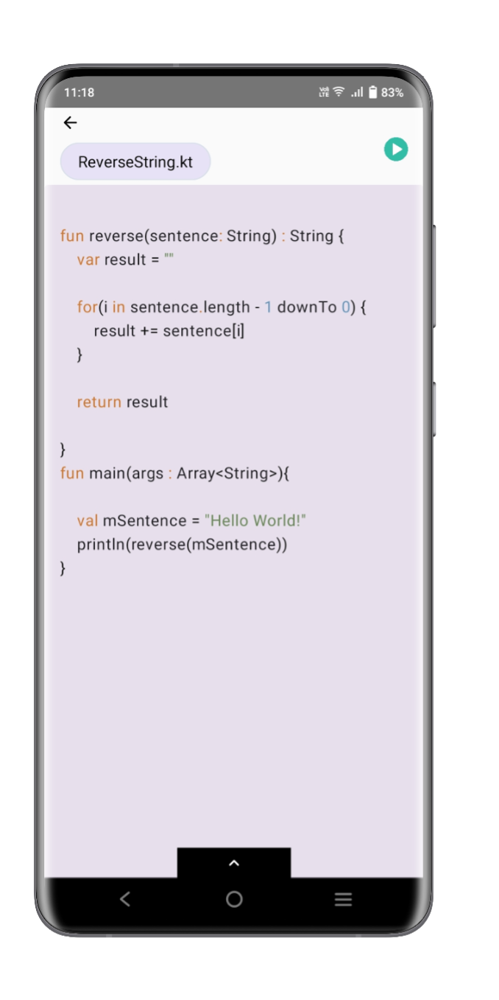
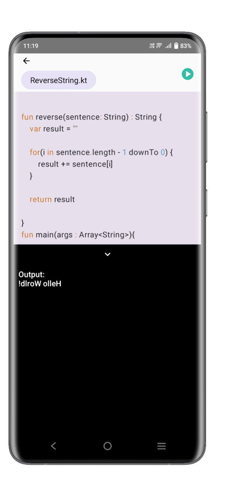

# KodeRunner - Compose Your Code, Anywhere, Anytime.



KodeRunner is a cross-platform application built with Kotlin Multiplatform, supporting Android, iOS, Windows, Mac, Linux. Run code seamlessly across platforms, explore public snippets, and unleash the power of 35+ programming languages.

## Screenshots

<p style="text-align: center;">
  
  
  
  
  
</p>

https://github.com/Abhay-cloud/KodeRunner-Multiplatform/assets/54390973/8ef7bf64-6dd8-4170-b1e0-c8e0e1447a84

## Built Using 🛠

- [Kotlin Multiplatform](https://kotlinlang.org/lp/multiplatform/)
- [Kotlin Coroutines](https://github.com/Kotlin/kotlinx.coroutines)
- [Compose Multiplatform](https://www.jetbrains.com/lp/compose-multiplatform/)
- [Ktor](https://ktor.io/)
- [SQLDelight](https://cashapp.github.io/sqldelight/2.0.0-alpha05/)
- [Voyager](https://github.com/adrielcafe/voyager)
- [Highlights](https://github.com/SnipMeDev/Highlights)
- [Glot.io](glot.io)

All dependencies used: [Dependencies](/gradle/libs.versions.toml)

## Features ✨

- Public Snippets
- Code Execution
- 35+ Languages Support


## Installation 🛠️

1. Clone this repository:
   ```bash
   git clone https://github.com/Abhay-cloud/KodeRunner-Multiplatform.git
   ```

2. Check the library versions in [libs.versions.toml](https://github.com/Abhay-cloud/KodeRunner-Multiplatform/blob/master/gradle/libs.versions.toml) and ensure compatibility with your development environment.

3. Visit [glot.io](https://glot.io) to register and obtain your access token.

4. Paste your token [here](https://github.com/Abhay-cloud/KodeRunner-Multiplatform/blob/master/composeApp/src/commonMain/kotlin/dev.abhaycloud/koderunner/data/network/CodeRepository.kt#L76) in the specified location in `CodeRepository.kt`.

## Run KodeRunner on Different Platforms 🚀

### Android
To run the application on android device/emulator:  
 - open project in Android Studio and run imported android run configuration

To build the application bundle:
 - run `./gradlew :composeApp:assembleDebug`
 - find `.apk` file in `composeApp/build/outputs/apk/debug/composeApp-debug.apk`

### Desktop
Run the desktop application: `./gradlew :composeApp:run`

### iOS
To run the application on iPhone device/simulator:
 - Open `iosApp/iosApp.xcproject` in Xcode and run standard configuration
 - Or use [Kotlin Multiplatform Mobile plugin](https://plugins.jetbrains.com/plugin/14936-kotlin-multiplatform-mobile) for Android Studio


## Contributors 📢

<a href="https://github.com/Abhay-cloud/KodeRunner-Multiplatform/graphs/contributors">
  
</a>

## Connect with me

[](https://www.linkedin.com/in/abhaysing-bhosale/)
[](https://twitter.com/abhaycloud_dev)
[](https://www.instagram.com/its_sn_abhay/)
